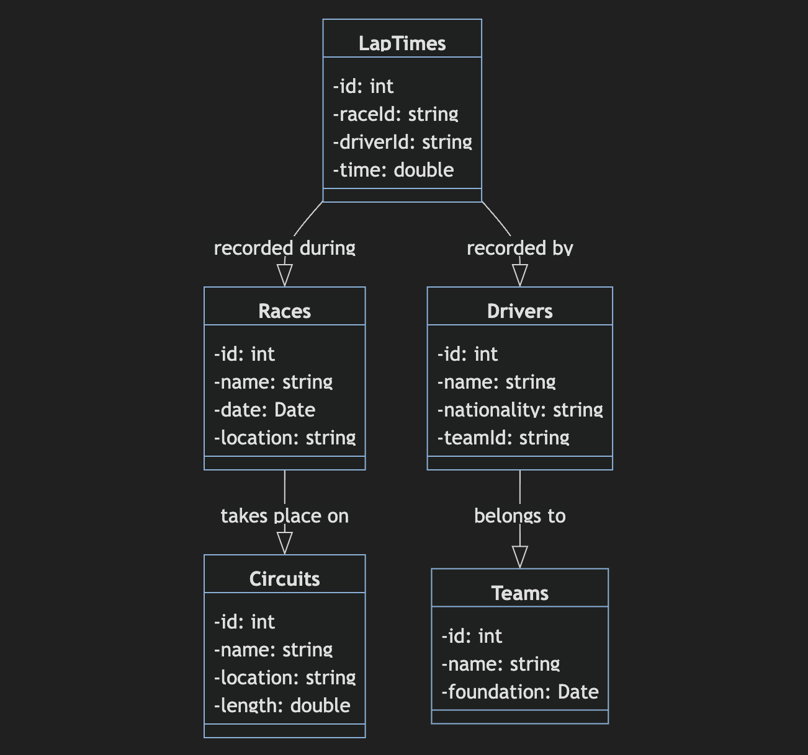

# Formula 1 API
C'est une API qui permet d'avoir les principales données sur la Formule 1

## Installation local
Installer les packages du projet
```bash
npm install
```

Faire attention que lorsqu'on RUN l'API qu'il pointe bien vers :
```
routes/index.js
```

## Accéder l'API en ligne

## Spécification du système 


## Spécification OpenAPI

La spécification OpenAPI est disponible dans le fichier iuyvbzepu.yaml mais la documentation Swagger est générée avec le fichier formula1.js grâce à la bibliothèque **swagger-ui-express** et **swagger-jsdoc**
